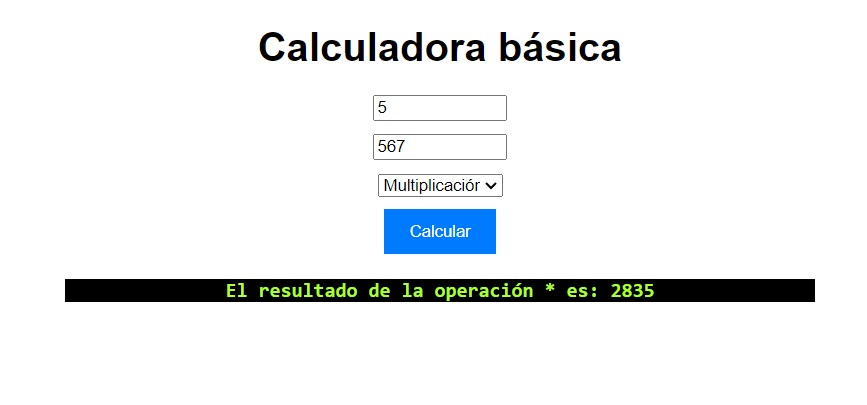

# Calculadora básica
- Versión: 1.0
- Autor: **Veronica Huertas**
- Licencia: MIT




[Cómo funciona la calculadora](README.md)


## Descripción general:
Esta aplicación tiene como intención facilitar el cálculo de las cifras. 


## Objetivos
Esta aplicación tiene como objetivo principal ayudar al usuario a resolver sus cálculos básicos y agilizar el proceso de resolver operaciones matemáticas simples.

## Tecnologías utilizadas.
**html, css y js**


## Arquitectura del proyecto
Es una aplicación sencilla realizada con html, css y javascript. 
Consta de dos inputs y un boton que tiene funciones de js para realizar los cálculos
## Funcionalidades
Las funcionalidades para esta aplicación son todas las relacionadas con resolver operaciones matemáticas básicas: suma, resta, multiplicación y división.
## Instrucciones de uso
1. Escribe el primer número 
2. Escribe el segundo número
3. Elije la operación a realizar
4. Presiona el botón "Calcular" para ejecutar la operación
5. El resultado aparecerá debajo

## Instrucciones de instalación
Descarga el zip de la siguiente url: 
[https://github.com/nikatandem/calculadorabasica.git](https://github.com/nikatandem/calculadorabasica.git)
o en el shell haz un git clone.
```shell
git clone https://github.com/nikatandem/calculadorabasica.git
```
una vez descargado incluyalo en un repositorio y ejecutalo a través de un navegador.
```
http://localhost:3000/calculadorabasica
```

## Solución de problemas:
- Si no se han introducido números aparecerá el mensaje: "En ambos campos se deben introducir números"


## Información de contacto:
Puedes contactar con nostros, o proponer tu contribución a través de nuestro correo:
[nikatandem@gmail.com](mailto:nikatandem@gmail.com)

[Teléfono: 658513664](tel:+34666666666)


### Apéndices:
Más información en nuestro github:
[nikatandem](https://nikatandem.github.io)

## Versiones
|Versión|Fecha|Cambios|
|--|--|--|
|1.0|19/04/24|funcionalidad básica|

